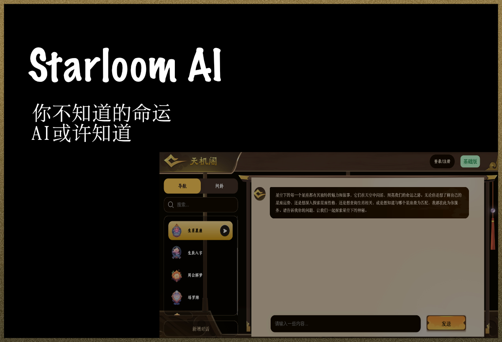

[](https://starloom.ai)

# StarLoom:基于AI的算命与占卜系统

欢迎来到StarLoom，一个由数据驱动的前沿占卜系统。深入探索宇宙的奥秘，探索您的星座，并揭开命运的秘密，所有这些都得益于人工智能的帮助。  
Starloom涵盖从远古龟卜、蓍占；到汉唐以来的周易八卦、八字算命、六爻算卦、梅花数；以及民间流传的称骨算命、抽签、测名、解梦等，同时亦有从西方传入的星座运程、塔罗牌占卜等，一个博古今，占未来的AI助手。
为何选择天机阁？   
1. 专家级AI训练   
我们的AI并非普通软件，而是基于专业占星师、命理师及玄学专家精心整理的数据构建。这意味着您获得的不仅是预测，更是扎根于正宗传统的深度见解。   
2. 一站式功能   
•	AI八字命理：解锁中国玄学密码，探索命运轨迹。   
•	AI星盘分析：精准解码您的占星蓝图。   
•	实时占卜：瞬间获得对人生重大问题的直觉答案。   
3. 个性化指引   
天机阁更像一场深度对话，而非机械应用。它提供清晰、有意义的解答，贴合您的独特需求。   

## 无需复杂代码，无需漫长开发周期，只需一个灵感火花✨，STARLOOM.ai 即刻为你点亮从概念到落地的全链路：
✅ 智能生成：AI自动拆解需求，输出可执行方案；   
✅ 极速迭代：实时优化产品原型，精准匹配用户需求；   
✅ 无缝协作：云端共享资源库，团队共创零距离；   
✅ 商业赋能：从技术架构到市场策略，一站式助力产品落地。

[传送门:starloom.ai](https://starloom.ai/#/)   
[关联产品传送门:yuanfen.ai](https://yuanfen.ai/#/)   
微信号：tianjige_ai   

## ⚾主要特点
- 古典的用户界面
- 适配移动端
- 支持Finetune
- 支持流式传输
- 支持本地部署
## 🎈系统功能
- starloom助理：从星座到解梦，StarLoom涵盖了占卜的各个方面
- 在线搜索: LLM数据陈旧，通过API和爬虫实现最新的数据访问的功能
- 知识库：加载使用文档和文件，进行embeding
- 本地部署：一键部署属于你的语言模型
- 提示功能：支持导入和修改prompt
## 🎱系统说明
- 支持中英双语切换
- 支持基于界面的模型切换
- 支持用户登录
- 输入框支持换行，聊天支持停止生成
- 支持聊天内容的复制
- 支持对聊天评论以及分享
- 对话记录自动保存，自动生成记录名
- 界面适配PC，MAC以及移动端
## ⚒️安装
1. Clone项目目录到本地
```
$ git clone https://github.com/starloom/starloom.git
```
2. 安装依赖关系
```
$ cd starloom
$ npm install
$ pip install -r requirements.txt
```
3. 在项目根目录下创建.env.local文件，然后增加该行
```
OPENAI_API_KEY=your_openai_api_key
```
4. 运行本地部署服务
```
$ npm run serve
```
5. 在浏览器中访问你的本地应用
```
http://localhost:3000
```
6. 使用界面内的发送框进行聊天  
   🍺享受属于您的旅程吧！
